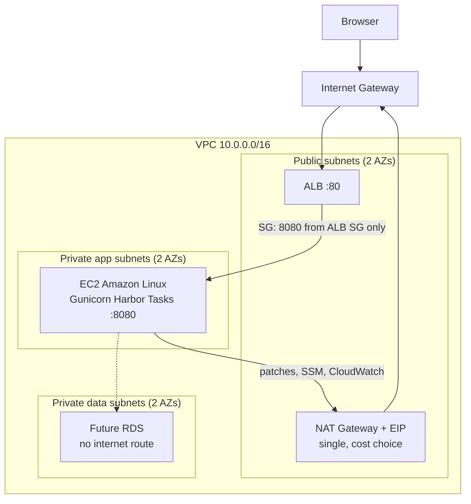

# DESIGN.md — Harbor Tasks on a custom VPC

Portfolio notes for a **secure 3-tier web app**. Written so a recruiter (or a future you, before an SAA exam) can see the *choices*, not only the resources.

---

## Requirements (half-build)

- Custom VPC across **two Availability Zones**
- **Public** subnets for the load balancer and NAT
- **Private app** subnets for compute (no public IP)
- **Private data** subnets reserved for a database (no NAT)
- Internet Gateway + NAT Gateway
- Application Load Balancer as the only inbound path to the app
- A **real** page and API, not a default nginx page
- IAM **roles**, no long-lived keys in the application
- CloudWatch **logs** for the app
- Cost must stay student-survivable: destroy after demo; one NAT

Non-goals for this half: custom domain, HTTPS, RDS, auto scaling, WAF, multi-account.

---

## Architecture

**Inbound:** User → IGW → ALB (public) → private IP :8080 on EC2.  
**Outbound from app:** EC2 → NAT (public subnet) → IGW → internet.  
**Not in the path:** SSH, a public IP on EC2, a database.

CIDRs:

| Subnet | AZ a | AZ b |
| --- | --- | --- |
| Public | 10.0.0.0/24 | 10.0.1.0/24 |
| App | 10.0.10.0/24 | 10.0.11.0/24 |
| Data | 10.0.20.0/24 | 10.0.21.0/24 |

---

## Choices

| Decision | Choice | Why |
| --- | --- | --- |
| IaC | **Terraform** | Common in internships; easy to read for SAA study. CDK would hide some IAM/VPC details behind constructs. |
| Compute | **EC2** + Gunicorn | SAA core: AMI, instance profile, user data, target groups. Fargate is fine later; it is one more control plane. |
| App | **Harbor Tasks** (Flask) | Small enough to bake into user data. Shows a UI, a health check, and `/api/info` with the instance AZ. |
| Storage | JSON file on disk | Honest half-build. Two instances would diverge. RDS is the next tier, not a fake “we totally have a DB” screenshot. |
| NAT | **One** gateway in AZ-a | Cuts the largest bill in half vs HA NAT. Tradeoff is explicit below. |
| Access | **SSM Session Manager**, port 22 closed | No bastion, no key pair. Interview-friendly. Needs outbound to SSM (via NAT). |
| Authn to AWS APIs | **Instance role** | CloudWatch Agent + `AmazonSSMManagedInstanceCore`. IMDSv2 required. |
| Load balancer | **ALB**, HTTP :80 | ALB must span two public subnets even with one instance. HTTPS needs ACM — later. |
| Data subnets | Created, empty, **no NAT** | Teaches “data tier should not browse the internet.” |

---

## Tradeoffs (say these out loud)

1. **One NAT vs two.** If AZ-a fails, private **outbound** fails (no yum, no SSM, no log ship). The ALB can still send **inbound** to an instance in AZ-b *if you run one there*. We default to one instance, so AZ failure of that instance is downtime. That is acceptable for a demo; it is not production HA.

2. **EC2 vs Fargate.** EC2 makes IAM and networking visible. You patch the box (user data + dnf). Fargate removes SSH-shaped thinking entirely but needs ECR, task roles vs task execution roles, and a different target type (`ip`).

3. **HTTP vs HTTPS.** Shipping HTTP keeps ACM/DNS out of the critical path. A recruiter may ask; the answer is “next step: ACM cert on a 443 listener, 80 redirects.” Do not pretend this is finished TLS.

4. **JSON file vs RDS.** Fast to deploy; not shared; lost on instance replace. The empty data subnets and `data` security group exist so adding PostgreSQL is a security-group + subnet change, not a redesign.

5. **Open egress on the app SG.** Inbound is tight. Egress `0.0.0.0/0` keeps SSM and dnf working without enumerating every AWS prefix. A later hardening pass is VPC endpoints (SSM, logs) so you can drop much of the NAT traffic.

6. **Single instance vs ASG.** An ASG + launch template is the real recovery story. A static `aws_instance` is easier to read on day one.

---

## Threat notes (half)

- The instance is not reachable on 22/80/443 from the internet.
- The ALB is reachable on 80 from the world — expected until HTTPS + maybe WAF.
- Tasks are not multi-user authenticated. This is a network/architecture project, not an identity project.
- User data contains the app source (compressed). That is a convenience, not a CI/CD pipeline.

---

## What I would change at “full” scope

1. RDS PostgreSQL Multi-AZ in the data subnets; app SG → db SG on 5432 only.
2. Launch template + Auto Scaling Group, min 2, across both app subnets.
3. ACM + HTTPS, HTTP redirect, and a Route 53 alias.
4. Alarms: ALB 5xx, unhealthy hosts, CPU, NAT bytes (cost).
5. Second NAT **or** VPC interface endpoints to shrink NAT.
6. Replace baked user data with an AMI or pull-from-S3 deploy.

---

## Failure scenarios (study these)

| Failure | What the user sees | Why |
| --- | --- | --- |
| App process down | 502 after health checks fail | ALB stops using the target |
| User data still installing | Unhealthy target, 502 | Wait; check `/aws/ec2/harbor-tasks` bootstrap logs |
| NAT deleted while instance runs | Page may still work | Inbound does not use NAT; outbound/SSM/logs break |
| Delete IGW | ALB goes dark | Internet-facing path is gone |
| Widen app SG to `0.0.0.0/0:8080` | Still no public IP, so not exposed | Security groups are not the only control; private IP + no IGW route on that subnet also matter — but do not do this |
