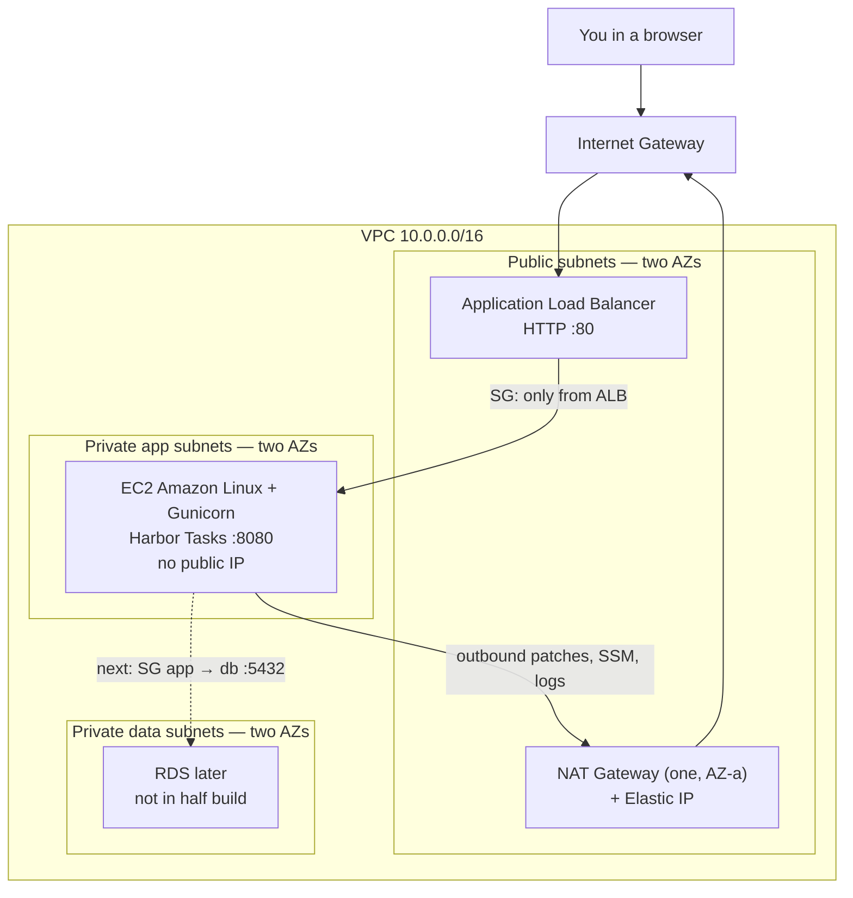

# Architecture (plain English)

Harbor Tasks is a **3-tier** layout on a **custom VPC**. You do not use the default VPC. You draw the network.

Related: [Project brief](./project-brief.md) · [AWS concepts](./aws-concepts.md) · [Learning path](./learning-path.md)

---

## Picture

Two availability zones means two copies of each subnet type (public, app, data). The ALB always spans **both** public subnets. The half-build runs **one** EC2 in one private app subnet so the bill stays small. The second app subnet is ready for an Auto Scaling Group later.

---

## Traffic flow — inbound (someone opens the app)

Say you type the ALB DNS name in a browser.

1. **Internet** sends HTTP to the ALB’s public address.
2. The packet enters the VPC through the **Internet Gateway**.
3. The **ALB** in a public subnet accepts port **80**. Its security group allows `0.0.0.0/0` on 80 (HTTP). HTTPS is a later step.
4. The ALB looks at the **target group**. It only forwards to instances that pass **`GET /health`**.
5. The ALB connects to the EC2 **private IP**, port **8080**. The app security group allows 8080 **only from the ALB security group**, not from the world.
6. Gunicorn/Flask returns HTML or JSON. The ALB sends it back to you.

You never talk to the EC2 public IP, because **there isn’t one**.

---

## Traffic flow — outbound (the app needs the internet)

Private instances still need the internet for `dnf install`, CloudWatch Agent, and SSM Session Manager.

1. EC2 sends to `0.0.0.0/0`.
2. The **private app route table** sends that traffic to the **NAT Gateway**.
3. NAT sits in a **public** subnet, has an **Elastic IP**, and goes out via the **Internet Gateway**.
4. Replies come back the same way. The internet never initiates a connection to EC2.

**Interview sentence:** NAT is for *outbound from private subnets*. IGW is for *the VPC as a whole to reach / be reached from the internet*. The ALB uses the IGW for inbound. The app uses NAT for outbound.

---

## CIDR map (what the Terraform uses)

VPC: `10.0.0.0/16`

| Tier | AZ a | AZ b | Internet |
| --- | --- | --- | --- |
| Public (ALB, NAT) | `10.0.0.0/24` | `10.0.1.0/24` | Route to IGW |
| Private app (EC2) | `10.0.10.0/24` | `10.0.11.0/24` | Route to NAT |
| Private data (future DB) | `10.0.20.0/24` | `10.0.21.0/24` | **No NAT** — data tier stays isolated |

---

## Security groups (the real firewall you will use)

Think of a security group as a **label + rules** on an ENI (a network card).

| Group | Allows in | Allows out |
| --- | --- | --- |
| `alb` | TCP 80 from anywhere | TCP 8080 to `app` SG |
| `app` | TCP 8080 from `alb` SG | TCP 443 to anywhere (yum, SSM, CloudWatch) |
| `data` (stub) | none yet | none extra |

No SSH (port 22) on the app box. You use **SSM Session Manager** and the instance role.

NACLs stay default (allow all). You will *know* they exist for the exam; you will not fight them in this half-build. See [aws-concepts.md](./aws-concepts.md).

---

## IAM (how the box is allowed to log, not how you log in)

- The EC2 instance assumes an **instance profile / role**.
- Policies: CloudWatch Agent logs, plus `AmazonSSMManagedInstanceCore`.
- The Flask app has **zero AWS keys**. Tasks are stored in a JSON file on disk (half-build). A database comes later.

Your laptop uses `aws configure` / SSO. That is a **person**. The server uses a **role**. Do not mix them.

---

## What is still a stub

- **Database.** Data subnets exist. RDS does not.
- **Second app instance / ASG.** ALB can hit many targets; we register one.
- **HTTPS.** Listener is HTTP only.
- **Alarms.** Log group exists; no alarm on 5xx yet.
- **Second NAT.** If AZ-a dies, private outbound dies. Inbound via ALB can still work if the instance is in a healthy AZ — another interview talking point.

Walk these “next” items in [learning-path.md](./learning-path.md) after the URL works.
